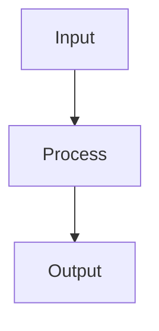

# Media Skill

## Image Generation

### Model

Use OpenAI `gpt-image-1` via API.

### API Call

```bash
curl -s https://api.openai.com/v1/images/generations \
  -H "Content-Type: application/json" \
  -H "Authorization: Bearer $OPENAI_API_KEY" \
  -d '{
    "model": "gpt-image-1",
    "prompt": "<prompt>",
    "n": 1,
    "size": "<size>",
    "quality": "high"
  }'
```

### Size Options

| Use Case | Size | Aspect |
|----------|------|--------|
| Blog header, landscape | 1536x1024 | 3:2 |
| Portrait, mobile | 1024x1536 | 2:3 |
| Square, social media | 1024x1024 | 1:1 |

Default to **1536x1024** (landscape) unless user specifies otherwise.

### Prompt Engineering

Write prompts that are:
1. **Specific** — Describe exactly what you want, not what you don't
2. **Styled** — Include art style (illustration, photograph, diagram, sketch)
3. **Composed** — Describe layout, foreground/background, lighting
4. **Concise** — Under 200 words, most detail in first sentence

#### Prompt Template

```
[Art style] of [subject] [doing action] in [setting].
[Composition details]. [Color palette]. [Mood/lighting].
```

#### Examples

- Blog header: "Clean minimal illustration of a developer workflow with connected nodes and data flowing between them. White background, blue and teal accent colors, modern flat design."
- Portrait: "Professional headshot-style illustration, warm studio lighting, neutral background, confident expression."

### Response Handling

The API returns a base64-encoded image or URL. Save to file:

```bash
# Extract and save from base64 response
echo "$RESPONSE" | jq -r '.data[0].b64_json' | base64 -d > output.png
```

## Diagrams

For technical diagrams, prefer **Mermaid** syntax rendered to SVG:



Render with: `mmdc -i diagram.mmd -o diagram.svg`

## Rules

- Always confirm the desired style and size before generating
- Save generated images with descriptive filenames
- For blog posts, default to landscape (1536x1024)
- Include alt text descriptions for accessibility
- Do not generate images of real people without explicit consent
